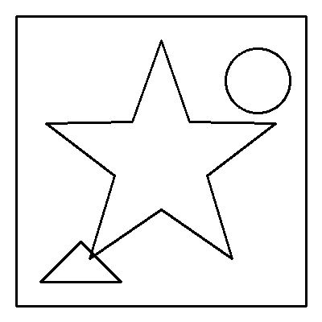
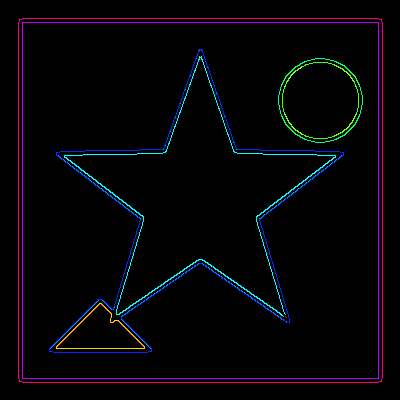
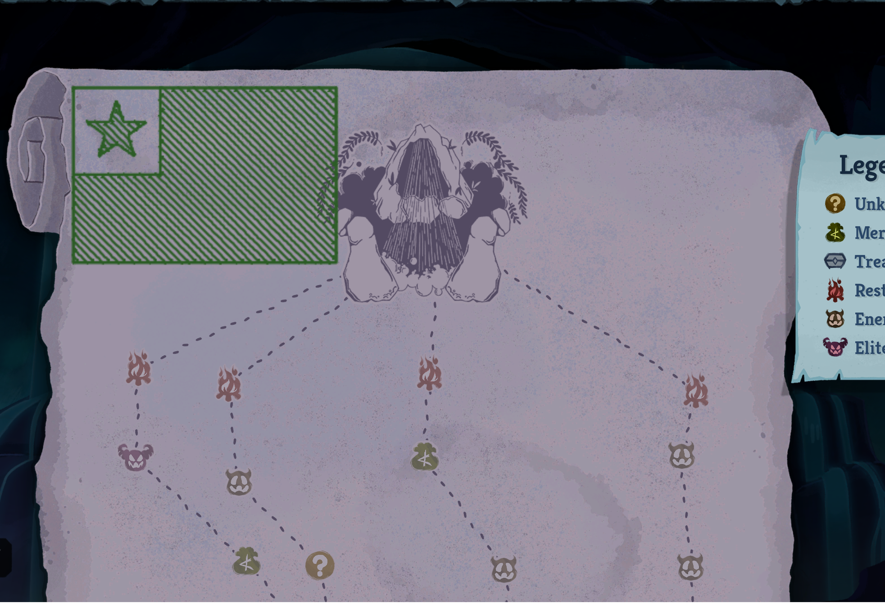

# STS2 Map Painter

[](https://github.com/ashaid/slaypentri/actions/workflows/tests.yml)
[](https://github.com/ashaid/slaypentri/stargazers)

Traces image contours as mouse strokes within a screen bounding box. Load a PNG, preview detected edges, click two corners to define your canvas, and the tool replays every contour as a mouse-driven brush stroke.

Built for painting map contours in Slay the Spire 2's map editor, but works with any application that accepts mouse input.

## Requirements

- Python 3.10+
- Linux (X11 or Wayland with XWayland — most desktops work out of the box)
- Dependencies: OpenCV, NumPy, PyYAML, pyautogui, pynput

## Installation

```bash
git clone https://github.com/ashaid/slaypentri.git && cd slaypentri
pip install -r requirements.txt
```

## Quick Start

```bash
# 1. Run with an example image
python painter.py examples/simple_star.png

# 2. Preview window shows detected contours — press any key to continue, Esc to abort

# 3. Click top-left corner of your target canvas area

# 4. Click bottom-right corner

# 5. Painting begins after countdown
```

## Preview

| Input | Detected Contours |
|:---:|:---:|
|  |  |

## Usage

```bash
python painter.py <image.png> [--fill] [--config path/to/config.yaml] [--dry-run] [--verbose]
```

| Flag | Description |
|------|-------------|
| `image.png` | Path to input PNG image (required) |
| `--fill` | Generate diagonal hatching strokes to fill colored regions |
| `--config` | Path to YAML config file (default: `config.yaml` next to `painter.py`) |
| `--dry-run` | Run pipeline and calibration but skip painting |
| `--verbose` | Enable debug output |

## Configuration

The tool reads from `config.yaml` (auto-generated on first run). All parameters have sensible defaults.

### Edge Detection

| Parameter | Default | Range | Description |
|-----------|---------|-------|-------------|
| `blur_kernel_size` | `5` | Odd integer, 1-31 | Gaussian blur kernel size. Higher = more noise reduction |
| `canny_low` | `50` | 0-255 or `"auto"` | Canny low threshold. `"auto"` uses Otsu-based detection |
| `canny_high` | `150` | 0-255 or `"auto"` | Canny high threshold. `"auto"` uses Otsu-based detection |
| `min_contour_px` | `10` | 0+ | Minimum contour arc-length in pixels. Increase to filter noise |
| `simplify_epsilon` | `1.5` | 0.0-10.0 | Douglas-Peucker simplification. Higher = fewer points, coarser lines |

### Calibration

| Parameter | Default | Range | Description |
|-----------|---------|-------|-------------|
| `countdown_seconds` | `3` | 1-10 | Seconds before each calibration click |

### Painting

| Parameter | Default | Range | Description |
|-----------|---------|-------|-------------|
| `mouse_button` | `right` | `"right"` or `"left"` | Mouse button used for strokes |
| `inter_stroke_delay` | `0.05` | 0.0-1.0 | Seconds between strokes. Increase if target app drops strokes |
| `start_delay` | `3` | 0-30 | Countdown seconds before painting begins |
| `inter_point_delay` | `0` | 0.0-0.1 | Seconds between points within a stroke. 0 = fastest |

## Workflow Tips

- **Too many contours?** Increase `min_contour_px` or `simplify_epsilon`
- **Missing detail?** Lower `canny_low` or decrease `simplify_epsilon`
- **Strokes not registering?** Increase `inter_stroke_delay` or `inter_point_delay`
- **Wrong thresholds?** Set `canny_low: auto` and `canny_high: auto` for automatic detection
- **Abort mid-paint:** Press Esc at any time to stop immediately

## Fill Mode

Use `--fill` to fill colored regions with diagonal hatching strokes, not just outlines.

```bash
python painter.py esperanto.jpg --fill
```



### Fill Configuration

| Parameter | Default | Range | Description |
|-----------|---------|-------|-------------|
| `spacing` | `8` | 1-50 | Perpendicular distance between fill lines. Lower = denser hatching |
| `angle` | `45` | 0-360 | Angle of fill lines in degrees. 0 = horizontal, 45 = diagonal |
| `min_run_px` | `5` | 1+ | Minimum run length in pixels to create a fill stroke |
| `step_px` | `5` | 1-50 | Pixels between points within a fill stroke. Lower = slower mouse, more reliable |

## Example

```bash
python painter.py examples/simple_star.png --verbose
```

This loads the included star pattern, shows a preview with contour count and estimated painting time, then walks you through calibration and painting.

## Troubleshooting

| Error | Solution |
|-------|----------|
| `Error: This tool requires an X11 session` | Your session has no `DISPLAY` set. Enable XWayland or run under X11 |
| `No contours detected` | Try `canny_low: auto` or lower threshold values |
| `Error: Image file not found` | Check the image path is correct and the file exists |
| Mouse moves but nothing paints | Check if the target app uses right-click for drawing; try `mouse_button: left` |

## License

AGPL-3.0
